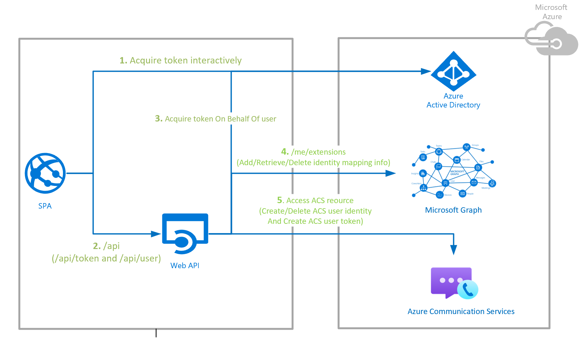

Deploy to Azure using instructions [here](./docs/deploy/deploy-and-test-sample-on-azure.md).

# ACS Solutions - Authentication Server Sample

[](https://github.com/Azure-Samples/communication-services-authentication-hero-csharp/actions/workflows/ci.yml)
[](https://github.com/Azure-Samples/communication-services-authentication-hero-csharp/actions/workflows/codeql-analysis.yml)
[](https://dotnet.microsoft.com/en-us/languages/csharp)
[](https://dotnet.microsoft.com/en-us/)
[](https://opensource.org/licenses/MIT)

1. [Overview](#overview)
2. [Endpoints](#endpoints)
3. [Getting Started](#getting-started)
4. [Code Structure](#code-structure)
5. [Architecture Overview](#architecture-overview)
6. [Building off of the sample](#building-off-of-the-sample)
7. [Publishing to Azure](#publishing-to-azure)
8. [Troubleshooting](#troubleshooting)
9. [Known Issues](#known-issues)
10. [Bring Your Own Identity (BYOI)](#bring-your-own-identity-byoi)
11. [Contributing](#contributing)
12. [Resources](#resources)
13. [Trademark](#trademark)
14. [License](#license)

## Overview

In order to properly implement a secure Azure Communication Services solutions, developers must start by putting in place the correct infrastructure to properly generate user and access token credentials for Azure Communication Services. Azure Communication Services is identity-agnostic, to learn more check out our [conceptual documentation](https://docs.microsoft.com/azure/communication-services/concepts/identity-model).

This repository provides a sample of a server implementation of an authentication service for Azure Communication Services (ACS). It uses best practices to build a trusted backend service that issues Azure Communication Services credentials and maps them to Azure Active Direction (AAD) identities. 

This sample can help you in the following scenarios:
1. As a developer, you need to enable an authentication flow for joining native ACS and/or Teams Interop calling/chat which is done by mapping an ACS identity to an AAD identity and using this same ACS identity for the user to fetch an ACS token in every session.
2. As a developer, you need to enable an authentication flow for Custom Teams Endpoint which is done by using an M365 AAD identity of a Teams' user to fetch an ACS token to be able to join Teams calling/chat.

If you are looking to get started with Azure Communication Services, but are still in learning / prototyping phases, check out our [quickstarts for getting started with azure communication services users and access tokens](https://docs.microsoft.com/en-us/azure/communication-services/quickstarts/access-tokens?pivots=programming-language-csharp).

> :loudspeaker: An ACS Solutions - Authentication Sample (NodeJS version) can be found [here](https://github.com/Azure-Samples/communication-services-authentication-hero-nodejs).



Additional documentation for this sample can be found on [Microsoft Docs](https://docs.microsoft.com/azure/communication-services/samples/calling-hero-sample). !!! TODO: change link?

Since this sample only focuses on the server APIs, the client application is not part of it. If you want to add the client application to login user using AAD, then please follow the MSAL samples [here](https://github.com/AzureAD/microsoft-authentication-library-for-js).

Before contributing to this sample, please read our [contribution guidelines](./CONTRIBUTING.md).

## Endpoints

This ACS Solutions - Authentication server sample provides the following endpoints:

- **GET /user** - Get an ACS identity through Microsoft Graph.

- **POST /user** - Create an ACS identity and then add the roaming identity mapping information to Microsoft Graph.

- **DELETE /user** - Delete the identity mapping information from Microsoft Graph including the ACS resource related to the ACS identity.

- **GET /token** - Get / refresh an ACS token for an ACS user.

- **GET /token/teams** - Exchange an M365 token of a Teams user for an ACS token.

  > :information_source: Teams users are authenticated via the MSAL library against AAD in the client application. Authentication tokens are exchanged for Microsoft 365 Teams token via the ACS Identity SDK. Developers are encouraged to implement an exchange of tokens in their backend services as exchange requests are signed by credentials for ACS. In backend services, developers can require any additional authentication. Learn more [here](https://docs.microsoft.com/en-ca/azure/communication-services/concepts/teams-interop#microsoft-365-teams-identity).

## Getting Started

If you're wondering where to get started, here are a few scenarios to help you get going:

* "How does the ACS Authentication server sample work?"
  * Take a look at our conceptual documentation on:
    - [ACS Authentication Server Sample Architecture Design](./docs/design-guides/architecture-overview.md).
    - [Secured Web API Architecture Design](./docs/design-guides/secured-web-api-design.md).
    - [Identity Mapping Architecture Design](./docs/design-guides/identity-mapping-design-graph-open-extensions.md).
    - [AAD Token Exchange Architecture Design](). !!! TODO: add link
* "I want to see what this ACS Authentication Server sample can do by running it!"
  * Check out our [Run Authentication Sample](<docs/contribution-guides/3. run-authentication-sample.md>) guide. !!! TODO: guide user directly to #1 of contribution guides?
* "I want to submit a fix or a feature for this project"
  * Check out our [contribution guidelines](CONTRIBUTING.md) first.
  * Check out the following guides in sequence after coding.
    * [Test Your Changes](<docs/contribution-guides/4. test-your-changes.md>)
    * [Write Unit Tests](<docs/contribution-guides/5. write-unit-tests.md>)
    * [Submit a PR](<docs/contribution-guides/6. submit-a-pr.md>)
    * [Publish Your Changes](<docs/contribution-guides/7. publish-your-changes.md>)

## Code Structure

Here's the breakdown of the repo:

```
.
├── deploy - folder gathering all that is needed for Azure deployment
├── src
│    ├── Controllers - folder gathering each controller which describes the path of each route │and the method to call.
│    ├── Extensions - folder gathering all extensions like exeption handler middleware or service collection.
│    ├── Interfaces - folder gathering all interfaces.
│    ├── Models - folder gathering all objects.
│    ├── Properties - folder gathering properties needed to run the sample.
│    ├── Services - folder gathering all services used in the project like Microsoft Graph, Communication Services and Azure Active Directory.
│    ├── Program.cs - file containing the starting point of the sample.
│    └── Startup.cs - file containing configuration and setup of the sample.
└── tests - folder gathering all unit tests.
     ├── Controllers - folder gathering unit tests for each controller.
     └── Services - folder gathering unit tests for each service.
```

**Code dpendencies:**


## Architecture Overview

Coming soon...

!!! TODO: add architecture design doc link?

## Building off of the sample

Coming soon...

## Publishing to Azure

Coming soon...

## Troubleshooting

Coming soon...

## Known Issues

- ...

## Bring Your Own Identity (BYOI)

Coming soon...

(AAD B2C)

## Contributing

Join us by making a contribution. To get you started check out our [contribution guidelines](CONTRIBUTING.md).

We look forward to building an amazing open source ACS Authentication server sample with you!

## Resources

- [Azure Communication Services Documentation](https://docs.microsoft.com/en-us/azure/communication-services/) - Find more about how to add voice, video, chat, and telephony on our official documentation.
- [Azure Communication Services Hero Samples](https://docs.microsoft.com/en-us/azure/communication-services/samples/overview) - Find more ACS samples and examples on our samples overview page.
- [On-Behalf-Of workflow](https://docs.microsoft.com/en-us/azure/active-directory/develop/v2-oauth2-on-behalf-of-flow) - Find more about the OBO workflow
- [Creating a protected API](https://github.com/Azure-Samples/active-directory-dotnet-native-aspnetcore-v2/tree/master/2.%20Web%20API%20now%20calls%20Microsoft%20Graph) - Detailed example of creating a protected API

## Trademark

**Trademarks** This project may contain trademarks or logos for projects, products, or services. Authorized use of Microsoft trademarks or logos is subject to and must follow [Microsoft’s Trademark & Brand Guidelines](https://www.microsoft.com/en-us/legal/intellectualproperty/trademarks/usage/general). Use of Microsoft trademarks or logos in modified versions of this project must not cause confusion or imply Microsoft sponsorship. Any use of third-party trademarks or logos are subject to those third-party’s policies.

## License

[MIT](LICENSE.md)
