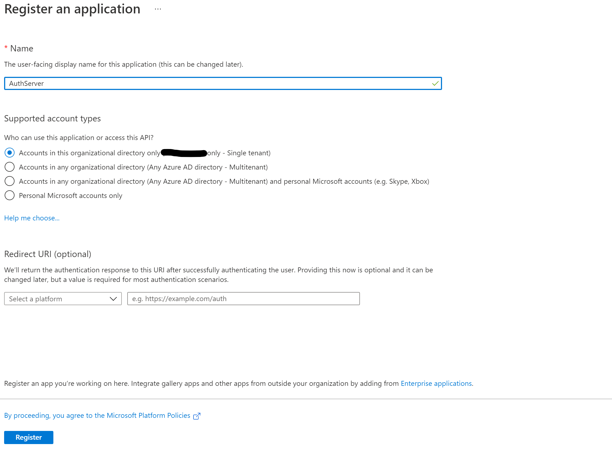
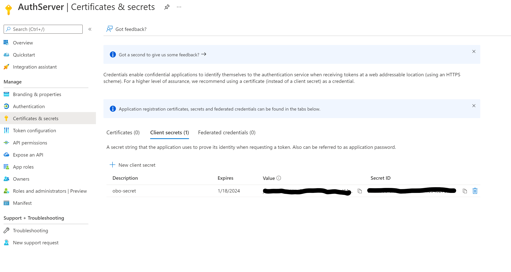
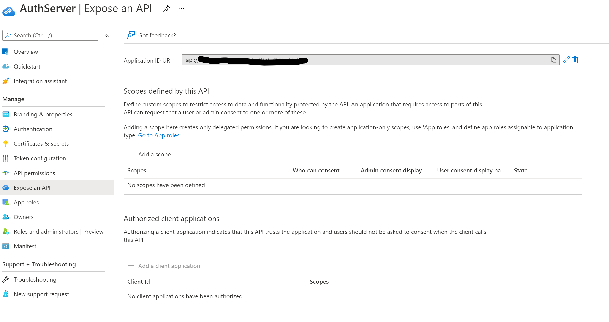
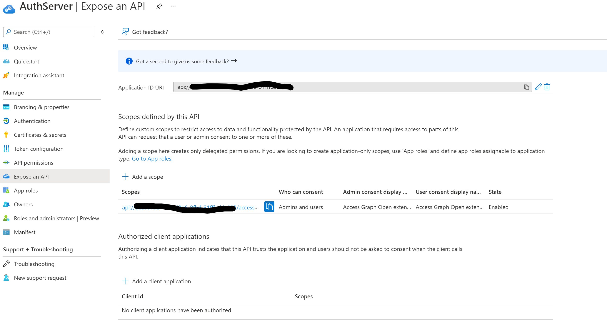
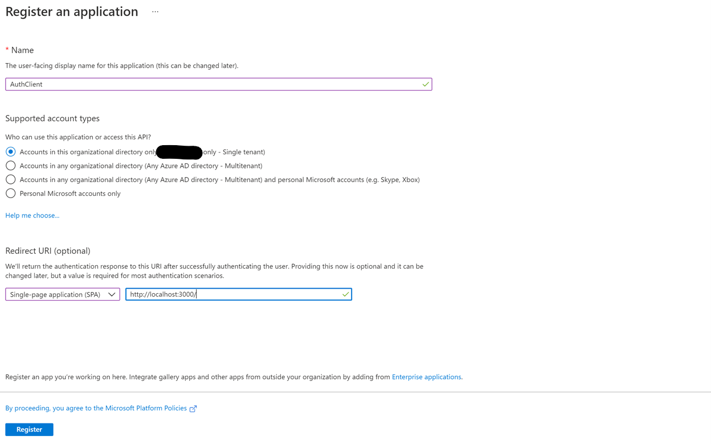
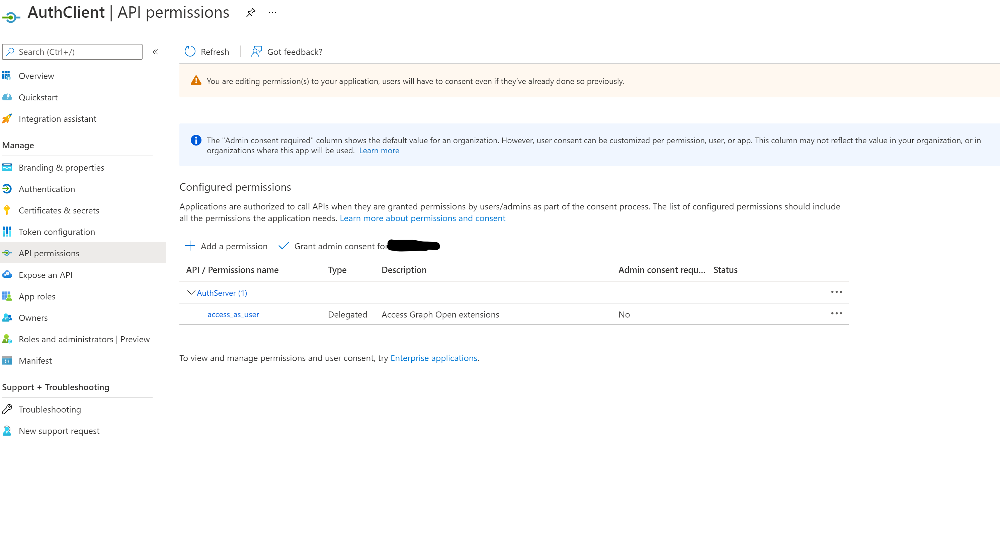
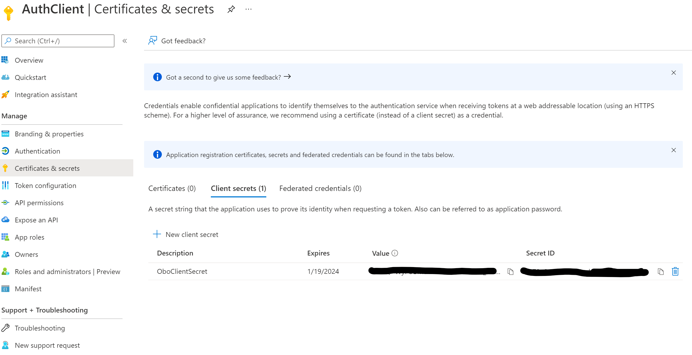

# Set up App Registrations (For Secure Web Api)
App Registrations are required to set up security on Web Api using [On-Behalf-Of flow](https://docs.microsoft.com/en-us/azure/active-directory/develop/v2-oauth2-on-behalf-of-flow). The following set up walks you through steps required to create app registrations for for ACS Authentication Server sample.

## Server App Registration
Follow instructions on how to register your server application with Azure Active Directory [here](https://docs.microsoft.com/azure/active-directory/develop/quickstart-register-app)

When registering use the following information:
    - name your application `AuthServer`
        - select the 'Accounts in this organizational directory only (Microsoft only - Single tenant)' option for who can use or access this application
        - click on 'Register' and it will open your application page once registration is successful
        

On your AuthServer page:
  - navigate to and click on 'Certificates & Secrets' menu item
    - on the 'Client secrets' tab, click on 'New client secret' to create a new one
    - add a description, select an expiration time and click 'Add'
    - this will be used later on
    
  - navigate to and click on 'API permissions' menu item
    - click on 'Add a permission'
    - select 'Microsoft Graph' under 'Microsoft APIs' tab on the page that is presented
    - select 'Delegated Permissions'
    - now scroll under 'Permission' list to reach 'User'
    - expand 'User' to select permissions 'User.Read' and 'User.ReadWrite'
    - click on 'Add Permissions' button on the same page below
    - once the permissions are added, select 'Grant admin consent' for the Microsoft Graph api call
    
    **Note:** The 'Grant admin consent' step can only be performed by your Azure Active Directory Admin.
    
  - navigate to and click on 'Expose an API' menu item
    - click on 'Set' beside 'Application ID URI'
      - this will automatically set an ID URI for your application
      - click on 'Save'
      
    - now click on 'Add a scope'
      - your scope should be `access_as_user`
      - select the 'Admin and users' option for who can consent
      - fill out the consent display name and description for both admin and user
      - select the 'Enabled' state
      - click on 'Add scope'
      

## Client App Registration

> Note:
>
> 1. This client app registration will be used to manually generate the AAD Token required to call AAD protected Web API as there is no client application in the sample. Follow instructions on how to register your client application with Azure Active Directory [here](https://docs.microsoft.com/azure/active-directory/develop/quickstart-register-app)
> 2. In order to implement the **Token Exchange** feature, please visit [this documentation](https://docs.microsoft.com/azure/communication-services/quickstarts/manage-teams-identity?pivots=programming-language-javascript#administrator-actions) to configure an App Registration for a Client.

When registering use the following information:
    - name your application `AuthClient`
        - select the 'Accounts in this organizational directory only (Microsoft only - Single tenant)' option for who can use or access this application
        - set the redirect URI selecting 'Single-page Application (SPA)' with `http://localhost:3000/` as url.  (**Note:** In case of manual generation of AAD Token for testing Auth Sample APIs, select 'Web' instead of SPA. )
        - click on 'Register' and it will open your application page once registration is successful
        

On your AuthClient page:
  - navigate to and click on 'API permissions' menu item
    - click on 'Add a permission'
      - navigate and click on 'My APIs' tab
      - select your 'AuthServer' application and choose 'Delegated permissions'
      - check 'access_as_user' box for permissions
      
  - now navigate to and click on 'Certificates & Secrets' menu item
    - on the 'Client secrets' tab, click on 'New client secret' to create a new one
    - add a description, select an expiration time and click 'Add'
    - this will be used later on to generate the AAD token
    
