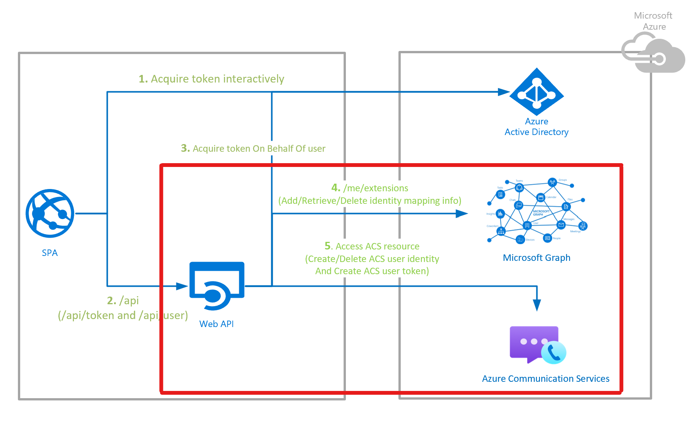

# Identity Mapping Design

## Table of content

- [Scenario](#scenario)
- [Overview](#overview)
- [1:1 ACS Identity and AAD user Identity mapping](#11-acs-identity-and-aad-user-identity-mapping)
- [Contributing](#contributing)
- [More Information](#more-information)

## Scenario

The sample solution focuses on Token management for below use cases:
- Joining the native ACS Chat, Calling / Teams Interop Meetings
- Joining the Teams meeting as Authenticated Team's user
The first scenario requires the identity mapping solution leveraged in `/token` and `/user` endpoints (endpoints implemented to support only the first scenario). The ACS identity is mapped to Azure Active Directory user instance, so that the same ACS identity for the user can be used in multiple sessions. Please refer the  [Azure Communication Services Identity Model](https://docs.microsoft.com/azure/communication-services/concepts/identity-model)

## Overview

This sample solution demonstrates how to utilize Microsoft Graph open extensions as the solution of identity mapping storage to build trusted backend service that will manage ACS identities by mapping them 1:1 with Azure Active Directory identities (for Teams Interop or native ACS calling/chat) and issue ACS tokens.

> Note: 
>
> 1. Developers should not use extensions to store sensitive personally identifiable information, such as account credentials, government identification numbers, cardholder data, financial account data, healthcare information, or sensitive background information.
> 2. Microsoft Graph has two Extension types: [Open extensions](https://docs.microsoft.com/graph/extensibility-overview#open-extensions) vs [Schema extensions](https://docs.microsoft.com/graph/extensibility-overview#schema-extensions) (**Untyped** data vs **Typed** data). The reason why we use the open extensions here is that we only store simple key-value mapping in this scenario, not typed data.
> 3. It is worth mentioning that maximum **2** **open extensions** are allowed per resource instance while **schema extensions** are **5**. Know more known issues, please visit [Known Extensions Limitations](https://docs.microsoft.com/graph/known-issues#extensions)

## 1:1 ACS Identity and AAD user Identity mapping

As displayed in the ACS Authentication Server - Identity Mapping overview sequence diagram below, the identity mapping part consists of two endpoints - `/user` and `/token`

Please refer the [endpoints](./endpoint-and-responses.md) for more details.

## Contributing

If you'd like to contribute to this sample, see [CONTRIBUTING.MD](../../CONTRIBUTING.md).

This project has adopted the [Microsoft Open Source Code of Conduct](https://opensource.microsoft.com/codeofconduct/). For more information, see the [Code of Conduct FAQ](https://opensource.microsoft.com/codeofconduct/faq/) or contact [opencode@microsoft.com](mailto:opencode@microsoft.com) with any additional questions or comments.

## More Information

For more information, visit the following links:

- To lean more about **Azure Communication Services - Identity**, visit:

  - [Quickstart: Create and manage access tokens](https://docs.microsoft.com/azure/communication-services/quickstarts/access-tokens?pivots=programming-language-javascript)
  - [Quickstart: Quickly create Azure Communication Services access tokens for testing](https://docs.microsoft.com/azure/communication-services/quickstarts/identity/quick-create-identity)
  - [Azure Communication Services Identity JavaScript SDK](https://azuresdkdocs.blob.core.windows.net/$web/javascript/azure-communication-identity/1.0.0/index.html)
- To learn more about **Microsoft Graph Open Extensions**: visit:
  - [Microsoft Graph Extensions Overview](https://docs.microsoft.com/graph/extensibility-overview)
  - [Add custom data to users using open extensions](https://docs.microsoft.com/graph/extensibility-open-users)
  - [Microsoft Graph Extensions Known Limitations](https://docs.microsoft.com/graph/known-issues#extensions)

