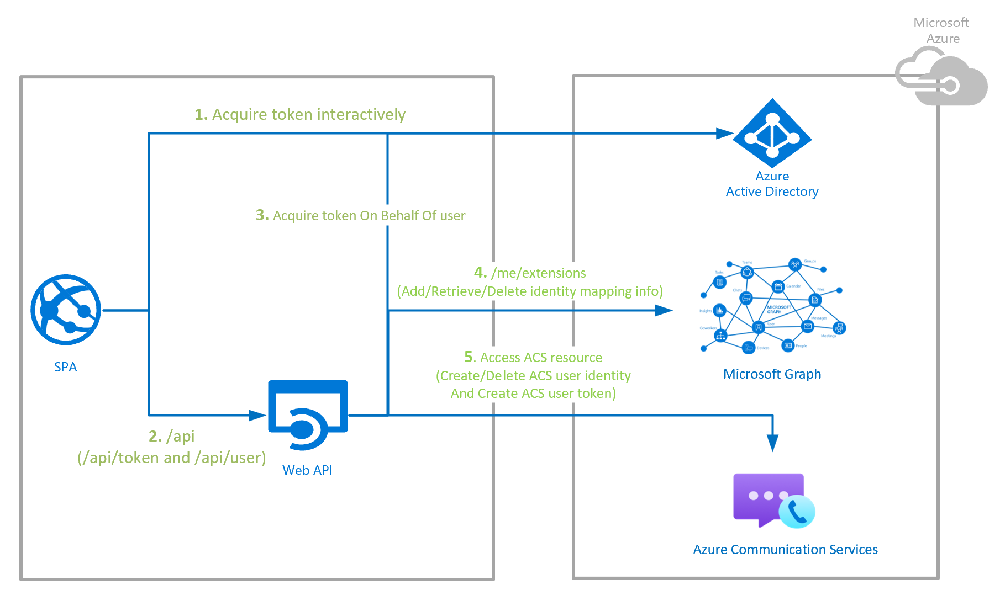

# Architecture Design

## Table of content

- [Overview](#overview)
- [Components](#components)
  - [Motivation for leveraging Graph Open Extensions for Identity Mapping](#motivation-for-leveraging-graph-open-extensions-for-identity-mapping)
- [Limitations](#limitations)
- [Guidance](#guidance)
- [Other Helpful Links to Explore](#other-helpful-links-to-explore)

## Overview
This sample solution is primarily focused on building the ACS Authentication Backend Server backed by Azure Active Directory as the Identity Provider and using open source libraries from [Microsoft Identity Platform](https://docs.microsoft.com/en-us/azure/active-directory/develop/v2-overview). The sample solution can be used directly in below scenarios, otherwise the sample needs to be adapted as described in Guidance section below:
- The Azure Active Directory is configured to support single tenant use case. 
> Note: You can verify the configuration through app registration used for user sign in flow for Azure Active Directory instance. Go to the specific app registration within Azure Active Directory through [Azure Portal](https://portal.azure.com/) and check the Authentication tab to verify the tenancy configuration.
- There are different Active Directory instances configured for different environments. 
> Note: The sample only supports identity mapping for single environment within Graph Open Extensions used for storage of identity mapping.

## Components

As seen from the Overview Diagram, the key components of the solution are:
1. [Secure Web Api backed by Azure Active Directory](./secured-web-api-design.md)
2. [Identity Mapping leveraging Graph Open Extensions](./Identity-Mapping-Design_Graph-Open-Extensions.md)
3. Azure Communication Identity service which generates ACS Identity and Tokens. The interaction with ACS Identity service happens within [ACS sdk](https://docs.microsoft.com/en-us/azure/communication-services/concepts/sdk-options#sdks) used within the solution. 
> Note: The `api/token/teams` endpoint does not leverage #2, as the M365 Azure Active Directory Identity is mapped to user's Teams Identity within ACS Identity Service.

### Motivation for leveraging Graph Open Extensions for Identity Mapping
The primary motivation comes from the fact that the Azure Communication Identity for the user could be co-located with rest of the information for the Active Active Directory user. And as that would also prevent the usage of additional storage for storing ACS Identity mappings corresponding to Azure Active Directory user Id.

## Limitations
- The open extensions on Azure Active Directory can only be supported upto 2 per user instance as suggested [here](https://docs.microsoft.com/en-us/graph/extensibility-overview#open-extension-limits). Hence supporting multi tenancy could be a challenge as different extensions might be desired for different tenants.
- There is Graph open extensions rate limit of 455 requests per 10 seconds as suggested [here](https://docs.microsoft.com/en-us/graph/throttling#open-and-schema-extensions-service-limits)
- The sample solution leveraging Graph open extensions might not be suitable for the scenarios where the Azure Active Directory instance is used for 3rd party application sign in as with [delegated permissions granted over Graph Api](https://docs.microsoft.com/en-us/graph/auth/auth-concepts#delegated-and-application-permissions). The 3rd Party application in this case with right delegated permissions would be able to access the open extension data of the user.
> Note: From data privacy perspective, the ACS Identity is categorized as [EUPI data](https://docs.microsoft.com/en-us/dynamics365/business-central/dev-itpro/developer/properties/devenv-dataclassification-property#property-value)

## Guidance
1. To support the multi environment scenario within Graph Open Extensions using the same Azure Active Directory user instance, you could extend the [IdentityMappingModel class](https://github.com/Azure-Samples/communication-services-authentication-hero-csharp/blob/main/src/Models/IdentityMappingModel.cs) to handle multiple environments.
2. If Graph open extensions does not meet your requirement for storage of Identity Mappings, you can consider storing them in databases as [CosmoDB](https://docs.microsoft.com/en-us/azure/cosmos-db/) or [Azure Tables](https://docs.microsoft.com/en-us/azure/storage/tables/) for an example. And you would need to update the write and read operations in [GraphService.cs class](https://github.com/Azure-Samples/communication-services-authentication-hero-csharp/blob/main/src/Services/GraphService.cs)
    - Replace the usage of Graph `/me/extensions` endpoint with [`/me`](https://docs.microsoft.com/en-us/graph/api/resources/users?view=graph-rest-1.0) endpoint. The `/me` endpoint will get the M365 user id in response as `id` attribute. This could be used as key to map the ACS Identity. The permissions for Graph Api on server app registrations just needs to be reduced to `User.Read`.
    - Persist the mapping of ACS Identity to M365 user id within the database of your choice.
    - Since the ACS Identity is classified as EUPI, please make sure all the required data privacy compliance are met on your end while the data is at rest and in transit.
3. Since Azure Communication Services is a data processor and you are the controller of the user data, you are responsible for ensuring the data privacy complaince. Please visit [here](https://docs.microsoft.com/en-us/azure/communication-services/concepts/privacy) for more information.

## Other Helpful Links to Explore
- [Graph Apis](https://docs.microsoft.com/en-us/graph/use-the-api)
- [Example on how M365 handles data rentention policy](https://docs.microsoft.com/en-us/compliance/assurance/assurance-data-retention-deletion-and-destruction-overview#data-retention) to meet the Data Privacy requirements for different data category.
- [Microsoft Identity Platform](https://docs.microsoft.com/en-us/azure/active-directory/develop/v2-overview)
- [Azure Communication Services Documentation](https://docs.microsoft.com/en-us/azure/communication-services/)
