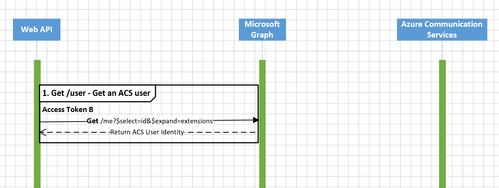
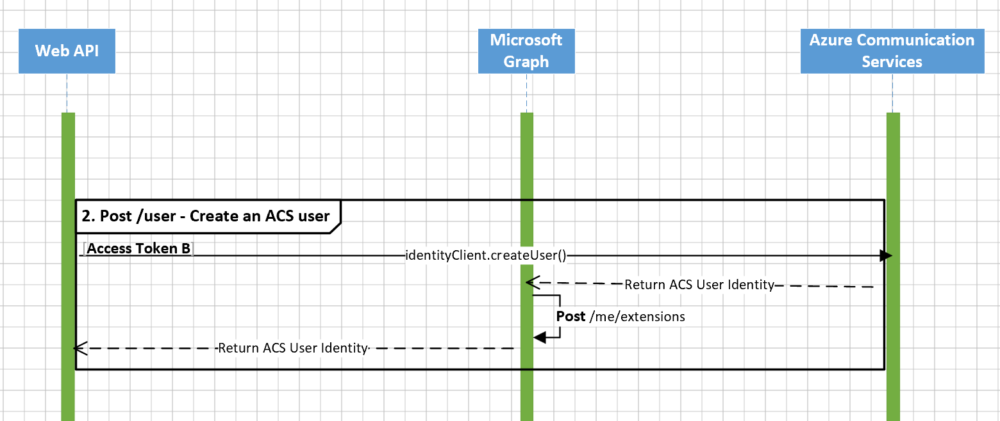
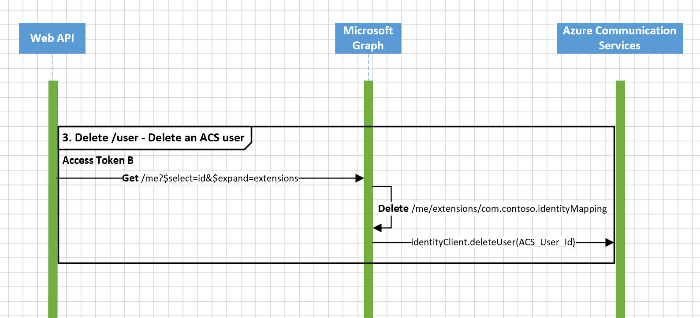
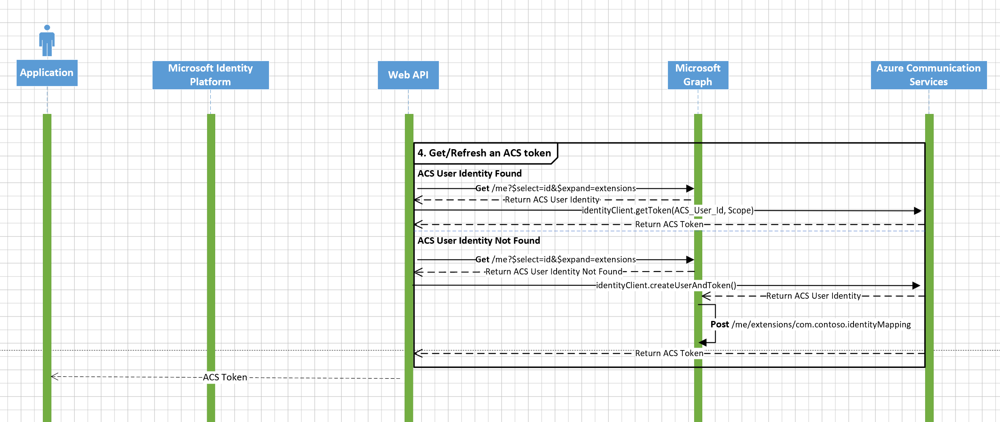

# Enpoints and Responses

## User Endpoint

The `/user` endpoint consists of three operations:

1. **GET** - Retrieve the Azure Communication Services identity from Microsoft Graph.
2. **POST** - Add an identity mapping information in Microsoft Graph
3. **DELETE** - Delete an identity mapping information from Microsoft Graph as well as the Azure Communication Services reource.

### ***GET*** /user

This endpoint is to get the Azure Communication Services identity by given Azure AD ID through Graph open extensions. If there is no related identity mapping stored previously, it will return an error message.



1. Get an Azure AD token exchanged via OBO flow. If failing to get an exchanged AAD token through the request *authorization* header, then return an error message:

   ```json
   {
       "code": 500,
       "message": "Fail to get the authorization code from the request header",
       "stack_trace": "Error: Fail to get the authorization code from the request header\n    at Object.getAADTokenViaRequest ..."
   }
   ```

   

2. Use the AAD token to retrieve the identity mapping information from Microsoft Graph by calling `/me?$select=id&$expand=extensions`.

   1. If there is an existing identity mapping information, then return

      ```json
      {
          "acsUserIdentity": "<communication-services-identity>"
      }
      ```

   2. If not, then return an info message

      ```json
      {
          "message": "There is no identity mapping information stored in Microsoft Graph"
      }
      ```
      
   3. If failing to call the Graph retrieving API, then return an error message:

      ```json
      {
          "code": 500,
          "message": "An error occured when retrieving the identity mapping information: <error_message>"
      }
      ```

      

### ***POST*** /user

This endpoint is to create a Communication Services identity and then add the roaming identity mapping information to the user resource through Graph open extensions. It will return an error message when failing to store the identity mapping information.



1. Get an Azure AD token exchanged via OBO flow. If failing to get an exchanged AAD token through the request *authorization* header, then return an error message.

2. Create a Communication Services identity using `createUser`.

   1. if successful, then use the AAD token to add the identity mapping information to the user resource through Graph open extensions by calling `/me/extensions`.

      1. If successful to store, then return

         ```json
         {
             "acsUserIdentity": "<communication-services-identity>"
         }
         ```

      2. If failing to store, then return an error message
   
         ```json
         {
             "code": 500,
             "message": "An error occured when adding the identity mapping information: <error_message>"
         }
         ```
   
   2. If not, then return an error message
   
      ```json
      {
          "code": 500,
          "message": "<message>",
          "stack_trace": "<stack_trace>"
      }
      ```

### ***DELETE*** /user

This endpoint is to remove the identity mapping from the user's ACS Identity data residing within Azure Active Directory user instance. 
To maintain Data privacy requirement as per GDPR, the user may have to be deleted. This endpoint ensures to provide a way to handle the scenario. More on [Data Privacy within ACS](https://docs.microsoft.com/en-us/azure/communication-services/concepts/privacy).



1. Get an Azure AD token exchanged via OBO flow. If failing to get an exchanged AAD token through the request *authorization* header, then return an error message.

2. Retrieve the Communication Services identity from Microsoft Graph.

   1. If successful to retrieve, delete the identity mapping information related to the retrieved identity from Microsoft Graph by calling `/me/extensions/<extensionName>`. 

      1. If successful to remove, delete the ACS user identity from Communication Services resource using `deleteUser` which revokes all active access tokens and prevents users from issuing access tokens for the identity. Also it will remove all the persisted content associated with the identity.

         1. If successful, then return

            ```json
            {
                "message": "Successfully deleted the ACS user identity <communication-services-identity> which revokes all active access tokens and removes all the persisted content, and the identity mapping"
            }
            ```

         2. If not, then return an error message
   
            ```json
            {
                "code": 500,
                "message": "<message>",
                "stack_trace": "<stack_trace>"
            }
            ```

      2. If not, then return an error message

         ```json
         {
             "code": 500,
             "message": "An error occured when deleting the identity mapping information: <error_message>"
         }
         ```
   
   2. If not, then return an error message
   
      ```json
      {
          "code": 500,
          "message": "<message>",
          "stack_trace": "<stack_trace>"
      }
      ```

## Token Endpoint

The `/token` endpoint only consists of one operation - `GET` used to **get** and **refresh** Communication Services tokens

### ***GET*** /token

When calling the endpoint, the first step is to check if there is an existing identity mapping information stored in Microsoft Graph. If not, a new Communication Services identity will be created and stored by this endpoint.



 Detailed process shows as follow:

1. Get an Azure AD token exchanged via OBO flow. If failing to get an exchanged AAD token through the request *authorization* header, then return an error message.

2. Retrieve the Communication Services identity from Microsoft Graph.

   1. If the identity mapping information exists, create a Communication Services token using `getToken`.

      ```json
      {
          "token": "<communication_services_token>",
          "expiresOn": "<token_expire_time_like_2022-01-10T00:48:44.507Z>"
      }
      ```
   
   2. If no identity mapping information exists, create a Communication Services identity and token `createUserAndToken` first.
   
      1. If failing to create an ACS identity and token, then return an error message.
   
         ```json
         {
             "code": 500,
             "message": "<message>",
             "stack_trace": "<stack_trace>"
         }
         ```
   
      2. If successful to create an ACS identity and token, then add the identity mapping information to the user resource using Graph open extensions.
      
         1. If successful to add, return the Azure Communication Services token to users.
   
            ```json
            {
                "token": "<communication_services_token>",
                "expiresOn": "<token_expire_time_like_2022-01-10T00:48:44.507Z>"
            }
            ```
         
         2. If not, then return an error message.
         
            ```json
            {
                "code": 500,
                "message": "<message>",
                "stack_trace": "<stack_trace>"
            }
            ```
