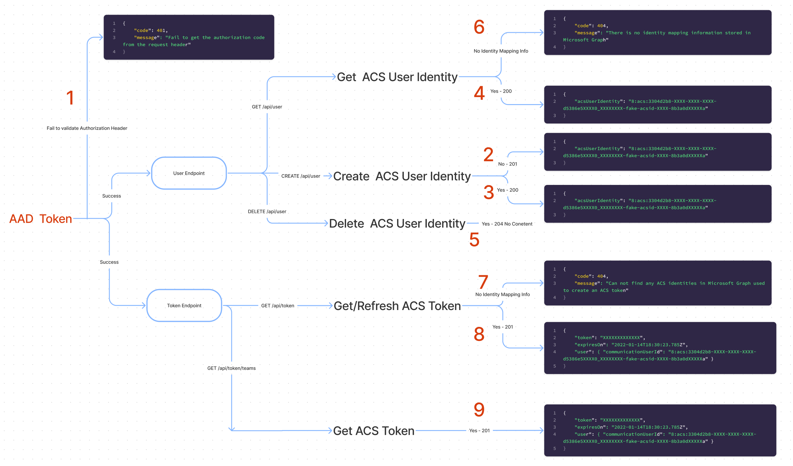

# Enpoints and Responses

## User Endpoint

The `/user` endpoint consists of three operations:

1. **GET** - Retrieve the Azure Communication Services identity from Microsoft Graph.
2. **POST** - Add an identity mapping information in Microsoft Graph
3. **DELETE** - Delete an identity mapping information from Microsoft Graph as well as the Azure Communication Services resource.

## Token Endpoint

The `/token` endpoint only consists of one operation - `GET` used to **get** and **refresh** Communication Services tokens

