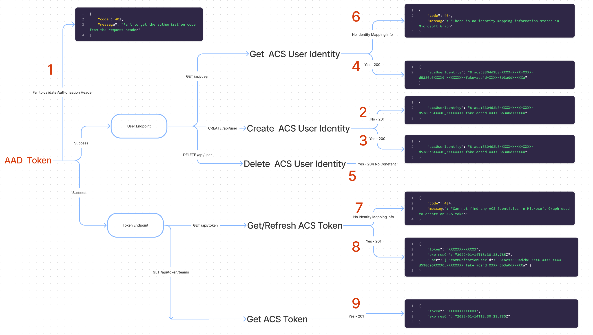

# Enpoints and Responses

## User Endpoint

The `/user` endpoint consists of three operations:

1. **GET** - Retrieve an Azure Communication Services identity from Microsoft Graph.
2. **POST** - Create an ACS identity and then add the roaming identity mapping information to Microsoft Graph.
3. **DELETE** - Delete an identity mapping information from Microsoft Graph including the ACS resource related to the ACS identity.

## Token Endpoint

The `/token` endpoint only consists of two operations:

1. **GET /token** - Get / refresh an ACS token for an ACS user.
2. **GET /token/teams** - Exchange an M365 token of a Teams user for an ACS token.

> :information_source: Teams users are authenticated via the MSAL library against Azure Active Directory in the client application. Authentication tokens are exchanged for Microsoft 365 Teams token via the ACS Identity SDK. Developers are encouraged to implement an exchange of tokens in their backend services as exchange requests are signed by credentials for ACS. In backend services, developers can require any additional authentication. Learn more [here](https://docs.microsoft.com/en-ca/azure/communication-services/concepts/teams-interop#microsoft-365-teams-identity).

