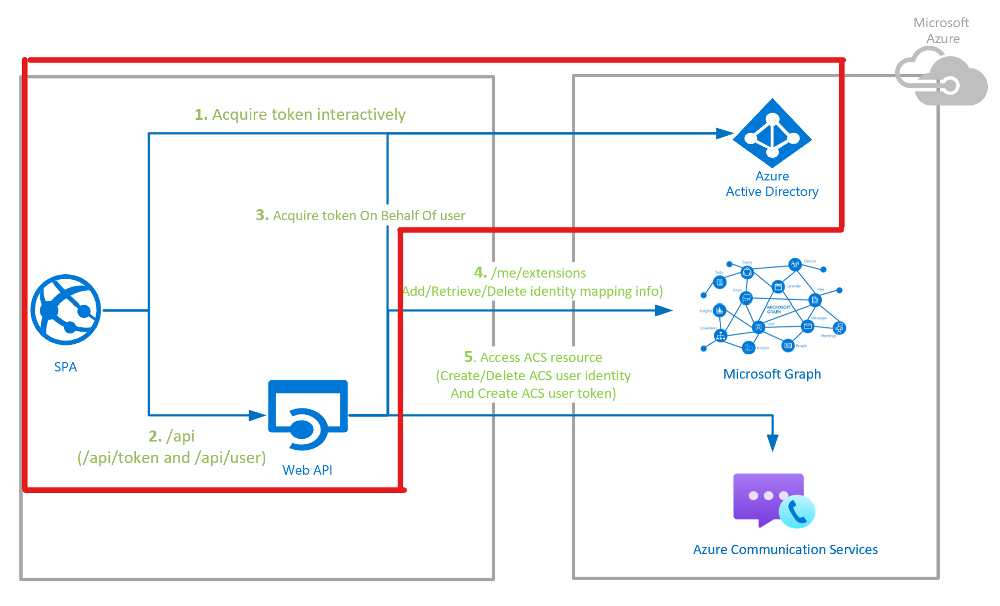

# Secured Web API Design

## Table of content

- [Scenario](#scenario)
- [Overview](#overview)
  - [On-Behalf-Of Flow (OBO Flow)](#on-behalf-of-flow-obo-flow)
- [Community Help and Support](#community-help-and-support)
- [Contributing](#contributing)
- [More Information](#more-information)

## Scenario

In this ACS Authentication Server sample, we would protect custom Web APIs using the Microsoft Identity Platform. The Web API, supporting authenticated users with personal Microsoft accounts as well as work and school accounts, will be protected using Azure Active Directory OAuth Bearer Authorization. Further on the API will also call a downstream API (Microsoft Graph) on-behalf of the signed-in user to provide additional value to its apps.

## Overview

This sample demonstrates how to call a ASP.Net core Web API, protected by [Azure Active Directory (Azure AD)](https://azure.microsoft.com/services/active-directory/) 

As displayed in the ACS Authentication Server flow diagram below, the secured Web API contains two parts:

1. Client side Authentication - This is outside of the scope for sample solution, however there are necessary tools provided for testing which can be learned from [deployment section](../deploy/deploy_test-sample-on-azure.md)
2. Make authenticated requests by a Web API to call a **downstream API** through **On-Behalf-Of flow** (Server side)

**Server Side (Step 3&4):**

1. Once the user is authorized passing the Azure Active Directory token (as would be gained on client side) in Authorization Header of the api call request, the flow acquires another access token on behalf of the signed-in user using the [On-Behalf-Of flow](https://docs.microsoft.com/azure/active-directory/develop/v2-oauth2-on-behalf-of-flow).
2. The Web API then uses this new access token to call downstream APIs (Microsoft Graph here).

### On-Behalf-Of Flow (OBO Flow)

The steps that follow constitute the OBO flow and are explained with the help of the following diagram.

1. The application makes a request to Web API with token A obtained through client app sign (as metioned, there are testing options recommended to handle the absence of client application in sample solution).
2. The Web API authenticates to the Microsoft identity platform token issuance endpoint and requests a token to access the downstream API (Microsoft Graph API here).
3. The Microsoft identity platform token issuance endpoint validates the Web API's credentials along with token A and issues the access token for the downstream Microsoft Graph API (token B) to the Web API.
4. Token B is set by the Web API in the authorization header of the request to the downstream Microsoft Graph API.
5. Data from the secured resource is returned by the downstream Microsoft Graph API to the Web API and then surfaced as API response.
